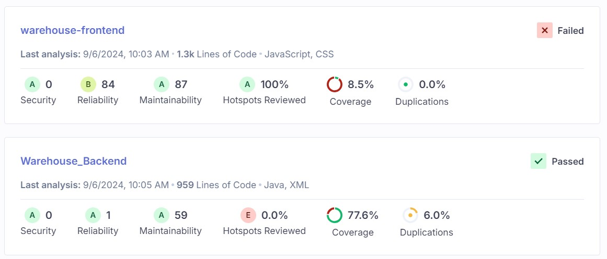
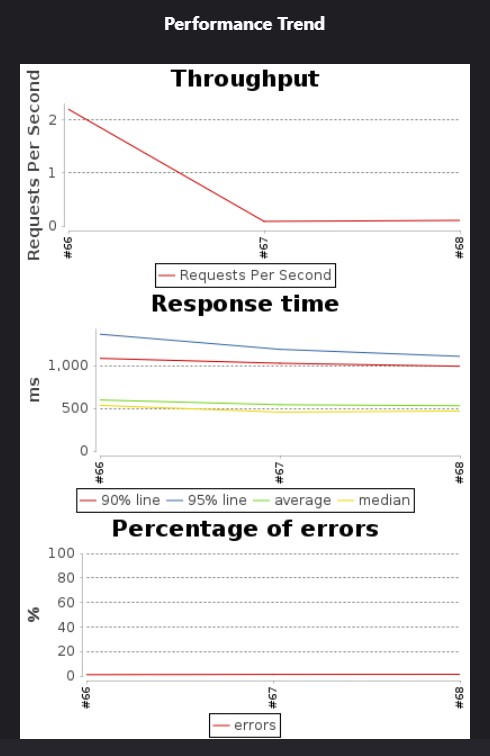
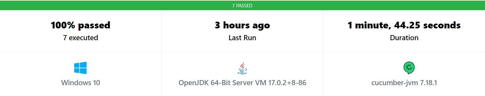
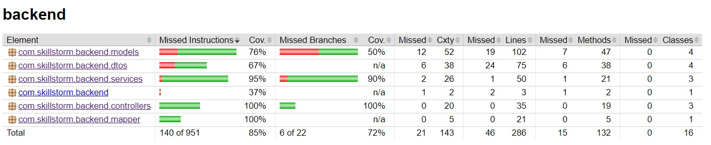

# Warehouse
This is a warehouse storage system for creating items and distributing them to different areas of the world.

There are 3 components to this project: frontend, backend, and sql.
The application was tested with Junit, TestNG, Cucumber, Selenium, and Jest.
Additional tests and reports in SonarQube, Jacoco, Jmeter, Burp Suite.

Application is deployed on AWS: http://team8-frontend.s3-website-us-east-1.amazonaws.com/

Jenkins Pipeline deployed on AWS: http://ec2-3-83-30-120.compute-1.amazonaws.com:8080/
![Image of latest Jenkins Pipeline][images/jenkins_pipeline.jpg]

SonarQube Results:

Jmeter Report: 

UPDATED Cucumber Report: 
https://reports.cucumber.io/reports/b54a5aed-648a-41de-ba9a-8129d66744ec
https://reports.cucumber.io/reports/5930d72c-1a2a-459d-a7c8-140168650846
https://reports.cucumber.io/reports/f296d1ea-6f5a-4c06-af6f-17f07b3bd967
https://reports.cucumber.io/reports/80434242-148d-4988-8ef1-b96e5513c566
https://reports.cucumber.io/reports/c95a58d0-9c2f-4f7f-8c0a-4a17bfe35331

Jacoco Backend Report:

